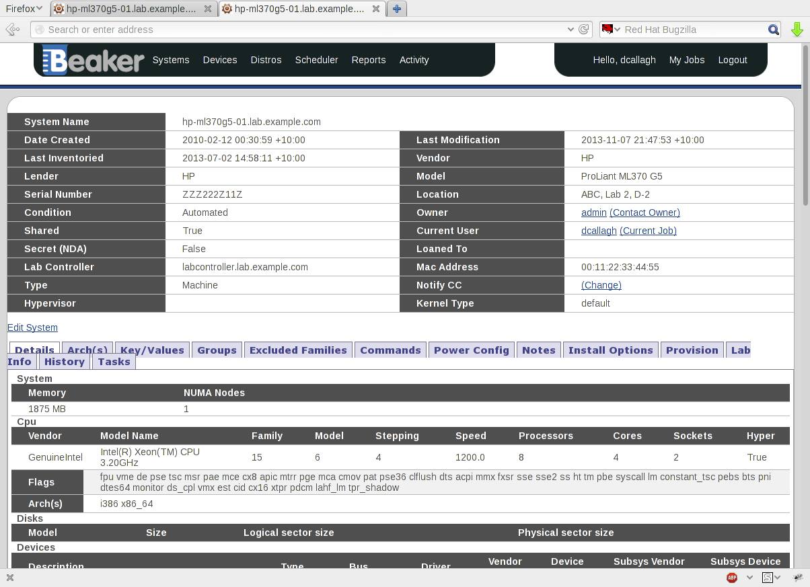
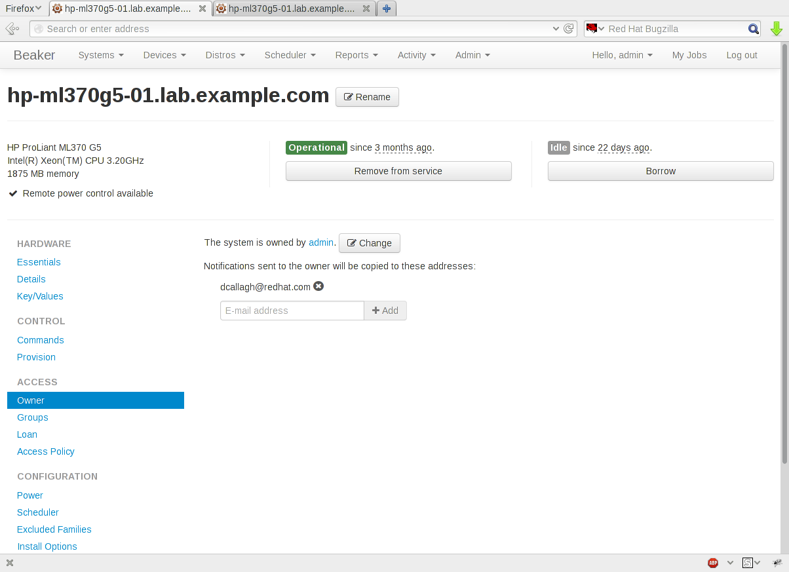
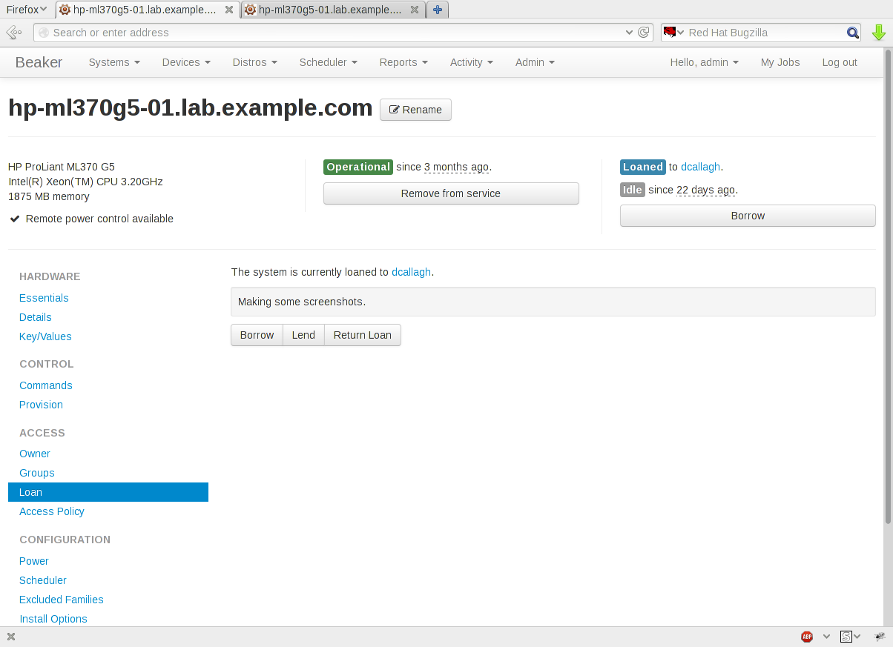
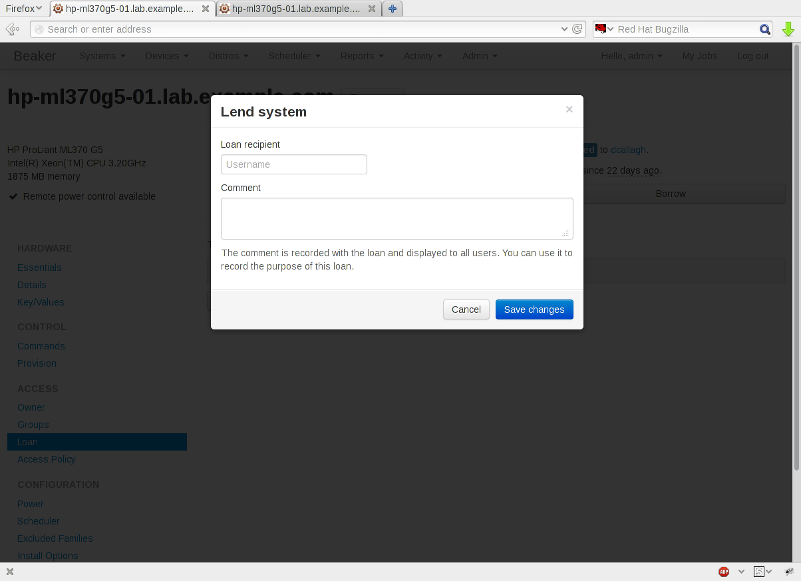
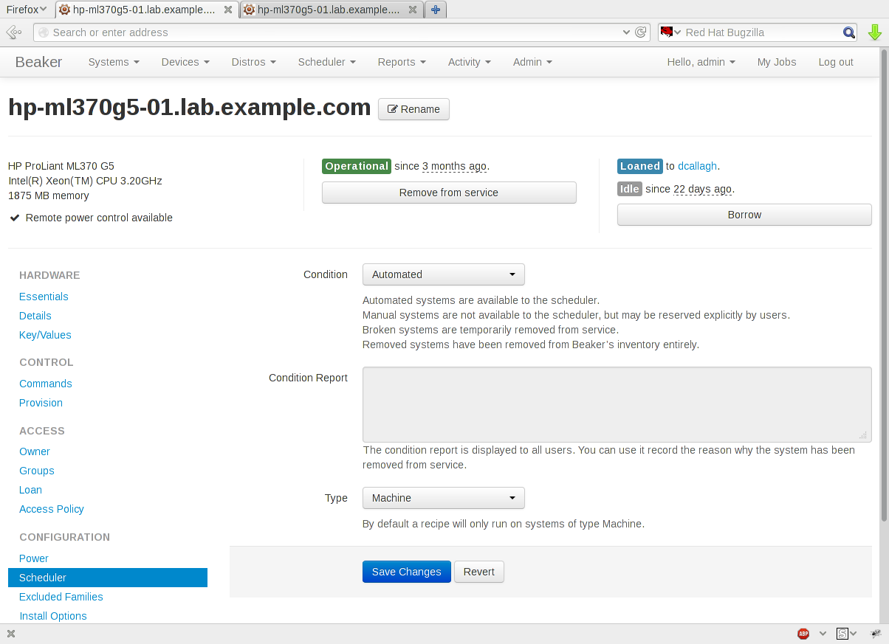
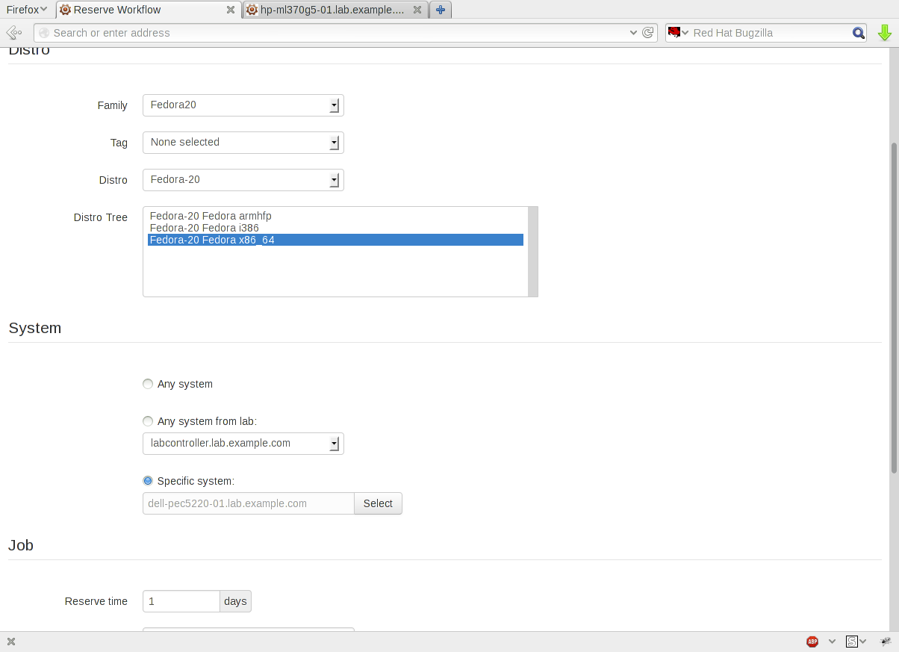
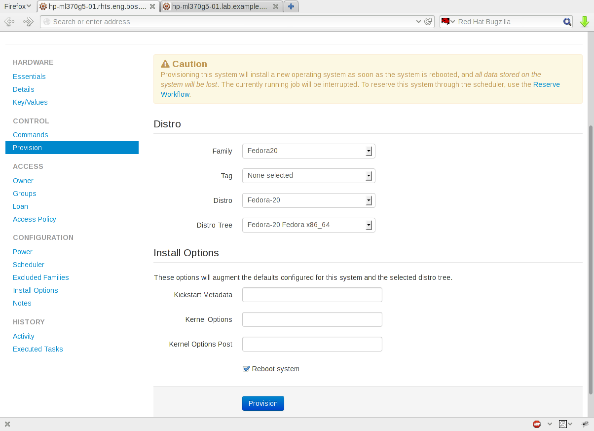

.. _proposal-system-page-improvements:

System Page Improvements
========================

:Author: Dan Callaghan
:Status: In Progress
:Target Release: 0.17

The system form --- the set of fields arranged in two columns at the top of the 
system page --- has existed since Beaker's inception as Medusa, a lab inventory 
tracking system. This document proposes rearranging the system page to replace 
the system form with three "quick info" boxes. The goal of the quick info boxes 
is to show the most important facts about the system and to give quick access 
to the most common operations, while occupying a very small amount of vertical 
space. The interface elements previously contained in the system form will be 
grouped in tabs below.

Background and rationale
------------------------

The system form is the original basis of the system page, and has always been 
its focal point. Over the years of Beaker's growth, additional functionality 
has accumulated either in tabs below the system form or as extra interface 
elements cluttered inside the form itself.

As a result, the system form conveys a disorganized assortment of data about 
the system, of which only a small amount is relevant for any given workflow on 
the page.

   An example of the system page in Beaker 0.14.

Due to the more generous form spacing introduced by Bootstrap in Beaker 0.15, 
the system form now occupies even more vertical space than it did before. This 
change only served to highlight how much irrelevant information was being shown 
at the top of the page (see for example bug :issue:`1015100`).

It has also been recognized for a long time that TurboGears 1.x widgets are not 
working for us. We can deliver a smoother, more efficient, and more functional 
experience by using a modern approach where HTML rendering is handled (at least 
partially) on the client side. This approach is only practical since Beaker's 
technology stack was upgraded in version 0.15 to use Flask on the server side 
and Bootstrap for client-side styling.

Mitigating impacts on screen scraping
-------------------------------------

The Beaker developers are aware that users have been forced to rely on scraping 
the system page in the past, due to the poor coverage of Beaker's API for 
systems. Unfortunately the proposed changes to the system page will 
substantially alter the HTML produced by the server, which may impact any 
screen scraping scripts.

During the 0.15.x release series the developers introduced a number of new 
:program:`bkr` subcommands for managing systems. These commands, along with the 
existing system-related subcommands, can be used instead of scraping the system 
page.

* Commands for viewing and manipulating access policies, which replaced
  group-based access control in Beaker 0.15.0: :program:`bkr policy-list`, 
  :program:`bkr policy-grant`, :program:`bkr policy-revoke`
* Commands for manipulating loans, added in Beaker 0.15.2:
  :program:`bkr loan-grant`, :program:`bkr loan-return`
* A command to fetch the status of a system (its condition, current reservation
  details, and current loan details), added in Beaker 0.15.3: :program:`bkr 
  system-status`

UI changes
----------

This section describes the proposed UI changes in detail.

All new user interface elements described here will use the Backbone JavaScript 
library to coordinate client-side rendering and updates. The client-side 
widgets fetch data from the server in JSON format and make asynchronous calls 
to update the server state without refreshing the page.

Quick info boxes
++++++++++++++++

There are three quick info boxes, displayed side-by-side at the top of the 
system page. See the screenshots below for an example.

The left-hand quick info box shows a summary of the system's hardware: vendor, 
model, CPU, and memory. It also indicates whether remote power control is 
available. In a future release it could also indicate whether remote console is 
available (currently Beaker does not record this information). The goal of this 
box is to quickly answer the question: "What is this system, and can it do what 
I need?"

The middle quick info box shows a summary of the system's health: current 
condition, condition report (if any), and number of recent aborted recipes. For 
the system owner, this box also contains a quick action button to remove the 
system from service (set its condition to Broken). For other users, it contains 
a button to send a problem report to the owner. The goal of this quick info box 
is to quickly answer the question: "Is this system healthy right now?"

The right-hand quick info box shows a summary of the system's usage: current 
loan, current user, and reservation length. It also contains a quick action 
button which allows one of the following operations, depending on the current 
state of the system and the user's permissions: Take, Return, Borrow, Return 
Loan, Request Loan. The goal of this quick info box is to quickly answer the 
question: "Can I use this system right now?"

Vertical tabs
+++++++++++++

The number of tabs on the system page has only grown over the years as features 
have been added to the page, and extracting functionality from the system form 
would require adding even more tabs. The horizontal tabs in Beaker 0.14 were 
already wrapping to two lines at many common browser widths. Therefore, the 
tabs were converted to a vertical "nav list" Bootstrap component with the tab 
content displayed beside. (This change was previously not possible using the 
TurboGears 1.x Tabber widget.)

The vertical tabs are visible in the screenshots below.

New :guilabel:`Hardware Essentials` tab
+++++++++++++++++++++++++++++++++++++++

A new tab, :guilabel:`Hardware Essentials`, contains the following fields which 
previously lived in the system form and held "essential" information about the 
system’s hardware:

* Lab controller
* Location
* Lender
* Kernel type

The tab also contains a field for :guilabel:`Supported Architectures`, 
replacing the :guilabel:`Arches` tab.

Here "essential" means information that the system owner fills in when 
registering the system in Beaker, as opposed to the hardware information on the 
:guilabel:`Hardware Details` tab which describes the internals of the system 
and is populated by Beaker's inventory script.

Beaker users will typically not be interested in the fields on the 
:guilabel:`Hardware Essentials` tab, so the target audience for this tab is 
primarily system owners.

.. figure:: system-page-improvements-screenshots/essentials-tab.png
   :width: 100%
   :alt: [screenshot of proposed Hardware Essentials tab]

Expanded :guilabel:`Hardware Details` tab
+++++++++++++++++++++++++++++++++++++++++

The following fields from the system form now appear on the :guilabel:`Hardware 
Details` tab instead. These fields describe internal hardware information about 
the system, and can (or should) be populated automatically by Beaker's 
inventory script.

* Host hypervisor
* Vendor
* Model
* Serial number
* MAC address

In addition, it is now possible to edit hardware details in the 
:guilabel:`System` section (which is the above fields plus the two existing 
:guilabel:`Memory` and :guilabel`NUMA Nodes` fields).

.. figure:: system-page-improvements-screenshots/details-tab.png
   :width: 100%
   :alt: [screenshot of proposed Hardware Details tab]

New :guilabel:`Owner` tab
+++++++++++++++++++++++++

A new :guilabel:`Owner` tab displays the system's current owner and notify CC 
list. These fields previously lived in the system form. The system owner can 
change the notify CC list or give the system to another user from this tab.

New :guilabel:`Loan` tab
++++++++++++++++++++++++

A new :guilabel:`Loan` tab displays the current loan state of the system, 
including any comment which was recorded. Users can borrow, return, or lend the 
system (according to their permissions). Any user can also request a loan from 
this tab. A modal is shown for lending the system, but all other operations 
require a single click.

This tab replaces the loan field and the associated :guilabel:`Loan Settings` 
modal window from the system form, as well as the loan request form which was 
previously accessed by clicking :guilabel:`Contact Owner` in the system form.

New :guilabel:`Scheduler Configuration` tab
+++++++++++++++++++++++++++++++++++++++++++

Lastly, for want of any better place to put them, these three fields from the 
system form which relate to how the scheduler handles the system are placed in 
a new :guilabel:`Scheduler Configuration` tab:

* Condition
* Condition report
* Type

Like the :guilabel:`Hardware Essentials` tab, these fields are typically only 
of interest to the system owner.

Benefits of the improved system page
------------------------------------

As well as fixing the immediate issues with the system page layout, the 
proposed changes will address a number of other long-standing flaws or 
shortcomings in the system page.

The system page has historically been one of Beaker's largest and most 
expensive pages to render, due to the amount of markup produced for all the 
widgets on the page. This proposal reduces the page size substantially, which 
will improve page load times for users.

Furthermore, the new system page widgets update the page in place when a change 
is made, avoiding an expensive page refresh for every action. They use clearer 
and more consistent indications of progress, success, and failure. For example, 
power commands appear in the command queue as soon as they have been enqueued, 
without re-fetching the entire system page.

The complete command queue will now be browsable in a grid on the 
:guilabel:`Commands` tab. Previously this was impossible due to the limitations 
of the TurboGears 1.x ``@paginate`` decorator.

In future, once all widgets are taking advantage of the new asset packing 
introduced with Beaker 0.15, it will also be possible to reduce the number of 
HTTP requests needed to load the system page. Currently this has a very large 
impact on the first load time for Beaker pages. This proposal does not solve 
the problem but makes large strides towards an eventual solution.

This proposal also takes small steps towards a more consistent and 
user-friendly interface across Beaker's entire web UI. All new system page 
widgets will adhere to Beaker's evolving :ref:`user interface guidelines 
<ui-guidelines>`, which were drafted as part of the work on this proposal.

The following user interface bugs/RFEs will be solved by the system page 
improvements:

* :issue:`692777` add a "duration" function on taken machines
* :issue:`884399` cannot remove default install options when provisioning
  a manual system
* :issue:`980352` no failure message when system update status can't be saved
* :issue:`999391` loaning system to unknown user produced error 500
* :issue:`999444` "Loan Settings" does not work on edit system page
* :issue:`1009323` after someone tries to edit the system which he doesn't have
  permission, browser should show the origin page instead of homepage
* :issue:`1009333` Beaker shows 500 error when someone tries to loan one system
  to others, but he only has loan-self permission
* :issue:`1011284` button "Loan Settings" disappeared after clicking button
  "Return Loan"
* :issue:`1011293` admin could see the button "Return Loan", even there is
  nobody was loaned to
* :issue:`1020107` changing loan settings does not automatically update the
  system page
* :issue:`1037280` meaning of "Hypervisor" field is not clear

Related improvements to the Reserve Workflow
++++++++++++++++++++++++++++++++++++++++++++

As part of the proposed improvements, the Reserve Workflow page will also be 
updated to use Backbone and to add some new features. The three steps of the 
Reserve Workflow (distro selection, system selection, job submission) will be 
combined onto a single page, instead of being spread across three pages. It 
will be possible to link to the Reserve Workflow specifying a particular system 
to be reserved.

Using this new feature, the system page can link to the Reserve Workflow for 
scheduling a reserve job. The :guilabel:`Provision` tab no longer needs to 
serve double duty for this purpose. Instead, it will be updated to always 
provision the system directly, not through the scheduler. This finally 
addresses a long-standing issue with the confusing behaviour of the 
:guilabel:`Provision` tab (see bug :issue:`855333` for background).

Deferred improvements
---------------------

This proposal does not cover upgrading any of the existing tabs on the system 
page which are not affected by the removal of the system form. These tabs will 
retain their existing TurboGears 1.x style of behaviour: each operation 
triggers a page refresh and a TurboGears flash message to indicate success or 
failure.

This proposal involves adding a number of new server-side interfaces for 
working with systems. They will be considered an internal Beaker implementation 
detail until they have been fleshed out and stabilized in a future release, at 
which point they may become public interfaces.
